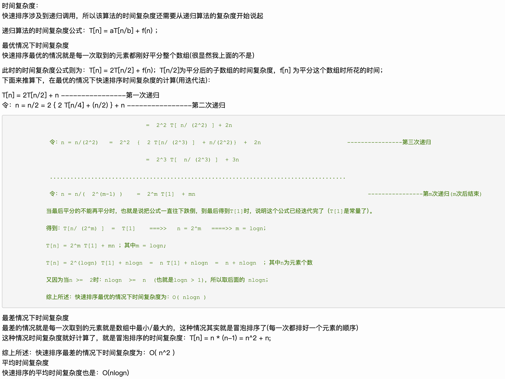

# 几个简单算法

                    

## 知识点

- 编写一段计算机程序一般都是实现一种已有的方法来解决某个问题

- 在计算机科学领域，我们用算法这个词来描述一种有限、确定、有效的并适合用计算机程序来实现的解决问题的方法。算法是计算机科学的基础，是这个领域研究的核心

- 大多数算法都需要适当地组织数据，而为了组织数据就产生了数据结构。数据结构也是计算机科学研究的核心对象，它和算法的关系非常密切

## 欧几里得算法

#### 自然语言描述

```textile
计算两个非负整数p和q的最大公约数：若q是0，则最大公约数为p。否则，将p除以

q得到余数r，p和q的最大公约数即为q和r的最大公约数
```

#### 过程


#### 实现

```java
public static Integer gcd(Integer a, Integer b) {
        return b == 0 ? a : gcd(b, a%b);
}
```

#### 性质


## 快速排序

#### 定义

- 快速排序（英语：Quicksort），又称分区交换排序（英语：partition-exchange sort），简称「快排」，是一种被广泛运用的排序算法。

- 工作原理是通过 分治 的方式来将一个数组排序

#### 过程

```
快速排序分为三个过程：
1.将数列划分为两部分（要求保证相对大小关系）
2.递归到两个子序列中分别进行快速排序
3.不用合并，因为此时数列已经完全有序
```

#### 实现

```java
public static void quickSort(List<Integer> valueList, Integer start, Integer end) {
        if (start >= end) {
            return;
        }
        Integer mid = partition(valueList, start, end);
        quickSort(valueList, start, mid - 1);
        quickSort(valueList, mid + 1, end);
    }

    public static Integer partition(List<Integer> valueList, Integer start, Integer end) {
        int mid = start;
        Integer midValue = valueList.get(start);

        for (int i = start; i <= end; i++) {
            if (midValue > valueList.get(i)) {
                swap(valueList, mid + 1, i);
                mid++;
            }
        }
        swap(valueList, start, mid);
        return mid;
    }

    public static void swap(List<Integer> valueList, Integer low, Integer high) {
        Integer tmp = valueList.get(low);
        valueList.set(low, valueList.get(high));
        valueList.set(high, tmp);
    }
```

#### 性质

- 不稳定排序，相等元素的相对顺序可能会改变
- 在实践中，几乎不可能达到最坏情况，而快速排序的内存访问遵循局部性原理，所以多数情况下快速排序的表现大幅优于堆排序等其他复杂度为 O(nlogn) 的排序算法


