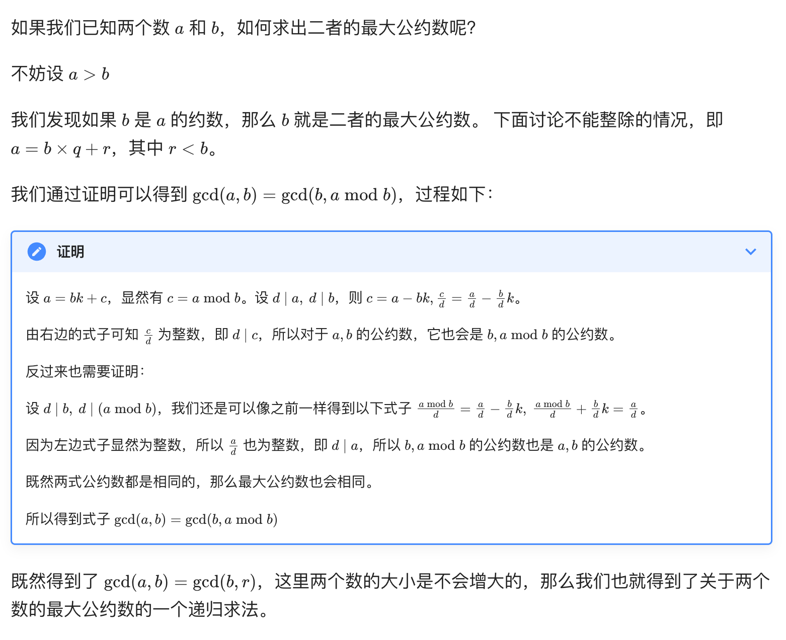
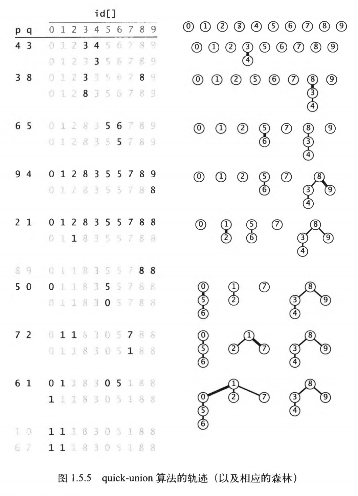
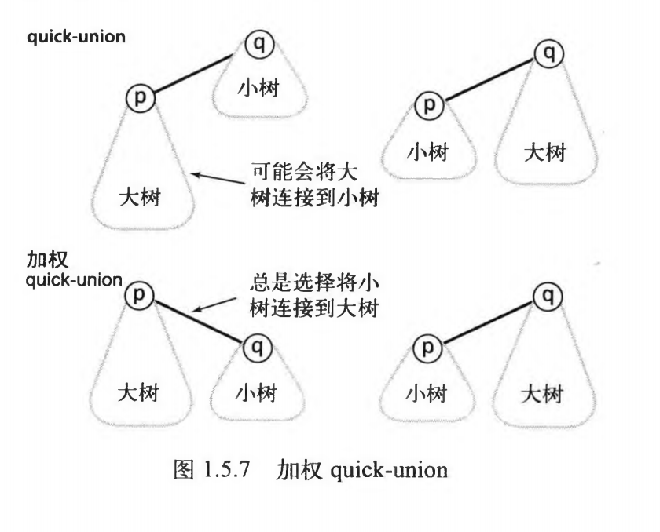

# 几个简单算法

## 知识点

- 编写一段计算机程序一般都是实现一种已有的方法来解决某个问题

- 在计算机科学领域，我们用算法这个词来描述一种有限、确定、有效的并适合用计算机程序来实现的解决问题的方法。算法是计算机科学的基础，是这个领域研究的核心

- 大多数算法都需要适当地组织数据，而为了组织数据就产生了数据结构。数据结构也是计算机科学研究的核心对象，它和算法的关系非常密切

## 欧几里得

### 描述

- 计算两个非负整数p和q的最大公约数：若q是0，则最大公约数为p。否则，将p除以q得到余数r，p和q的最大公约数即为q和r的最大公约数

### 过程



### 实现

```java
public static Integer gcd(Integer a, Integer b) {
        return b == 0 ? a : gcd(b, a%b);
}
```

### 性质


## 快速排序

### 描述

- 快速排序（英语：Quicksort），又称分区交换排序（英语：partition-exchange sort），简称「快排」，是一种被广泛运用的排序算法

- 工作原理是通过 分治 的方式来将一个数组排序 

### 过程

- 将数列划分为两部分（要求保证相对大小关系）

- 递归到两个子序列中分别进行快速排序

- 不用合并，因为此时数列已经完全有序

### 实现

```java
/*
理解：
1、取其中一个元素作为分区点pivot，遍历无序列表中其它数据，将比pivot小的放在左边，大的放在右边，重排无序序列并计算分区点
2、分别递归除分区点的左边、右边无序列表，重排无序序列并计算分区点，直至左右边只剩一个元素，元素也就排序好了

将比pivot小的放在左边，大的放在右边：
1、从i=start+1索引开始，如果值小于分区点，则j=start,j+1与i的值互换，j++
2、将第一个，也就是基准值与第j个元素互换，因为第j个值肯定小于等于第一个值，并返回j
*/
    public static void quickSort(List<Integer> valueList, Integer start, Integer end) {
        if (start >= end) {
            return;
        }
        Integer mid = partition(valueList, start, end);
        quickSort(valueList, start, mid - 1);
        quickSort(valueList, mid + 1, end);
    }

    public static Integer partition(List<Integer> valueList, Integer start, Integer end) {
        int mid = start;
        Integer midValue = valueList.get(start);

        for (int i = start; i <= end; i++) {
            if (midValue > valueList.get(i)) {
                swap(valueList, mid + 1, i);
                mid++;
            }
        }
        swap(valueList, start, mid);
        return mid;
    }

    public static void swap(List<Integer> valueList, Integer low, Integer high) {
        Integer tmp = valueList.get(low);
        valueList.set(low, valueList.get(high));
        valueList.set(high, tmp);
    }
```

### 性质

- 不稳定排序，相等元素的相对顺序可能会改变
- 在实践中，几乎不可能达到最坏情况，而快速排序的内存访问遵循局部性原理，所以多数情况下快速排序的表现大幅优于堆排序等其他复杂度为 O(nlogn) 的排序算法
- 缓存友好：由于快速排序是一种局部性很好的算法，它在处理数据时通常会访问连续的内存地址，这有利于利用现代计算机的缓存机制，减少内存访问次数，提高排序性能
- 可优化性：快速排序是一种灵活的算法，可以通过优化分区策略、基准元素的选择等方式来提高性能。例如，使用三路快排或随机化选择基准元素等方法可以改善快速排序在特定情况下的性能。


## 动态连通性

### 描述

- 触点：单个对象的网络方面用语

- 连接：整数对称为连接

- 等价类：p、q相连，q、r相连，则p、q、r属于同一个等价类

- 连通分量：等价类称为连通分量，简称分量

- 设计一个数据结构来保存已知的所有整数对的足够多的信息，并且用它来判断新的整数对是否相连，将这个问题通俗的地叫做动态连通性问题


### quick-find

#### 过程

- 保证当且仅当id[p]等于id[q]时，p、q是连通的。即在同一个连通分量中，所有触点在id[]中的值必须相同

#### 实现


```java
public class QuickFind {
    // 分量数量
    private Integer count;

    // 分量Id（以触点作为索引）
    private List<Integer> idList;

    public void UF(Integer N) {
        count = N;
        idList = new ArrayList<>();
        for (int i = 0; i < N; i++) {
            idList.add(i, i);
        }
    }

    public Integer find(Integer key) {
        return idList.get(key);
    }

    public Boolean connected(Integer p, Integer q) {
        return Objects.equals(find(p), find(q));
    }

    public void union(Integer p, Integer q) {
        Integer pID = find(p);
        Integer qID = find(q);
        if (Objects.equals(pID, qID)) return;
        for (int i = 0; i < idList.size(); i++) {
            if (find(i).equals(pID)) idList.set(i, qID);
        }
        count--;
    }

    public Integer count() {
        return count;
    }
}
```

#### 性质


### quick-union

#### 过程

- 基于相同的数据结构，以触点为索引的id[]数组

- 链接：每个触点所对应的id[]元素都是同一个分量中的另一个触点的名称（默认自己）

- 根触点：在实现find()方法时，从给定的触点开始，由它的链接得到另一个触点，再由这个触点链接到第三个触点，直到达到一个根触点，即链接指向自己的触点

- 当且仅当分别由两个触点开始的这个过程，到达了同一个根触点时，它们存在于同一个连通分量之中。为了保证这个过程的有效性，需要union()方法保证这一点

- union()的实现：由p和q的链接分别找到它们的根触点，然后只需要将一个根触点链接到另一个。也就是将一个分量重命名为另一个分量，将一个根节点变为另一个根节点的父节点

#### 实现



```java
public class QuickUnion {

    // 分量数量
    private Integer count;

    // 分量Id（以触点作为索引）
    private List<Integer> idList;

    public void UF(Integer N) {
        count = N;
        idList = new ArrayList<>();
        for (int i = 0; i < N; i++) {
            idList.add(i, i);
        }
    }

    public Integer find(Integer i) {
        // 找出根触点（开始时都是根触点）
        while (!i.equals(idList.get(i))) i = idList.get(i);
        return i;
    }

    public Boolean connected(Integer p, Integer q) {
        return Objects.equals(find(p), find(q));
    }

    public void union(Integer p, Integer q) {
        Integer pRoot = find(p);
        Integer qRoot = find(q);
        if (pRoot.equals(qRoot)) return;
        idList.set(pRoot, qRoot);
        count--;
    }

    public Integer count() {
        return count;
    }
}
```

#### 性质

- id[]用父链接的形式表示了一片森林。无论我们从任何触点所对应的节点开始跟随链接，最终都将达到含有该节点的树的根节点。可以用归纳法证明这个性质的正确性：在数组被初始化之后，每个节点的链接都指向它自己；如果在某次union()操作之前这条性质成立，那么操作之后它必然也成立
- 分析quick-union算法的成本比分析quick-find算法的成本更困难，因为这依赖于输入的特点。在最好的情况下，find()只需要访问数组一次就能够得到一个触点所在的分量的标识符；而在最坏情况下，这需要2N-1次数组访问，如图1.5.6中的0触点（这个估计是较为保守的，因为while循环中经过编译的代码对id[p]的第二次引用一般都访问数组）。由此我们不难构造一个最佳情况的输入使得解决动态连通性问题的用例的运行时间是线性级别的；另一方面，我们也可以构造一个最坏情况的输入，此时它的运行时间是平方级别的


### weight-quick-union

#### 过程

- 与其在union()中随意将一棵树连接到一棵树，现在会记录每棵树的大小并总是将较小的数连接到较大的树上

- 在quick-union基础上，需要增加一个数组和一些代码来记录树中的节点数

#### 实现




```java
public class WeightQuickUnion {

    // 分量数量
    private Integer count;

    // 分量Id（以触点作为索引）
    private List<Integer> idList;

    // 每棵树的元素数量（以触点为索引）
    private List<Integer> sizeList;

    public void UF(Integer N) {
        count = N;
        idList = new ArrayList<>();
        sizeList = new ArrayList<>();
        for (int i = 0; i < N; i++) {
            idList.add(i, i);
            sizeList.add(i, 1);
        }
    }

    public Integer find(Integer key) {
        while (!key.equals(idList.get(key))) key = idList.get(key);
        return key;
    }

    public Boolean connected(Integer p, Integer q) {
        return Objects.equals(find(p), find(q));
    }

    public void union(Integer p, Integer q) {
        Integer pRoot = find(p);
        Integer qRoot = find(q);
        if (pRoot.equals(qRoot)) return;
        if (sizeList.get(pRoot) < sizeList.get(qRoot)) {
            idList.set(pRoot, qRoot);
            sizeList.set(qRoot, sizeList.get(qRoot) + sizeList.get(pRoot));
        } else {
            idList.set(qRoot, pRoot);
            sizeList.set(pRoot, sizeList.get(pRoot) + sizeList.get(qRoot));
        }
        count--;
    }

    public Integer count() {
        return count;
    }
}
```

#### 性质

### 比较

#### 特点


#### 总成本


## 资料

- Algorithms 4.0 version by Robert Sedgewick

- https://oi-wiki.org/

- https://github.com/aistrate/AlgorithmsSedgewick

- [排序算法之 快速排序 及其时间复杂度和空间复杂度 - 酷酷的排球 - 博客园](https://www.cnblogs.com/01black-white/p/17213814.html)
